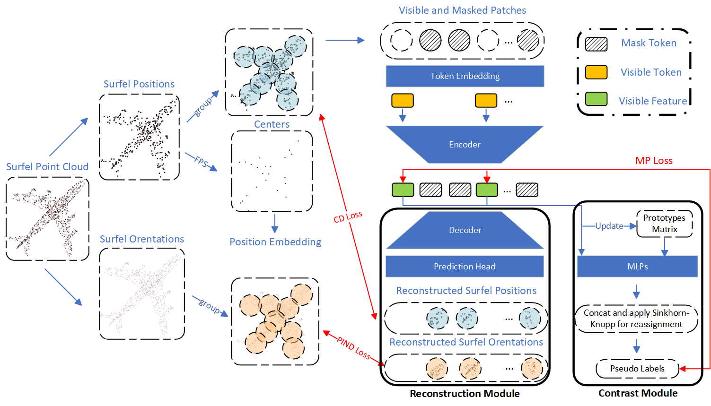

# CoRe

## CoRe: Contrast and Reconstruction Combination Self-Supervised Point Cloud Representation Learning

Contrast-based and reconstruction-based methods are two staple branches in self-supervised learning (SSL) for point cloud data. These two methods specialize in obtaining overall semantic level and local geometry features by comparing dissimilarity and rebuilding masked regions, respectively. However, to the best of our knowledge, no previous work has investigated the potential benefits of combining these two approaches for SSL pre-training and leveraging the characteristics of the two for complementarity. We propose a model that combines contrast and reconstruction (CoRe) tasks to pre-train encoders for point clouds in an SSL manner. Specifically, after splitting, grouping, and masking a complete point surface element (surfel) input, the contrast module enforces homologous visible patches to be as close as possible in the feature space; simultaneously, the reconstruction module tries to restore the masked surfel position (points) region and predict the corresponding surfel orientations (normals). We validate CoRe in four downstream tasks under three fine-tuning protocols. The experimental results show that CoRe SSL method achieved the state-of-the-art (SOTA) on 36 / 46 (78%) evaluation metrics on both synthetic and real-world datasets, which is competitive compared with the current best MaskSurf model.


|  |
|:-------------:|
| Fig.1: The overall framework of CoRe. |

## 1. Requirements
PyTorch >= 1.7.0;
python >= 3.7;
CUDA >= 9.0;
GCC >= 4.9;
torchvision;

```
pip install -r requirements.txt
```

```
# Chamfer Distance & emd
cd ./extensions/chamfer_dist
python setup.py install --user
cd ./extensions/emd
python setup.py install --user
# PointNet++
pip install "git+https://github.com/erikwijmans/Pointnet2_PyTorch.git#egg=pointnet2_ops&subdirectory=pointnet2_ops_lib"
# GPU kNN
pip install --upgrade https://github.com/unlimblue/KNN_CUDA/releases/download/0.2/KNN_CUDA-0.2-py3-none-any.whl
```

## 2. Datasets

We use ShapeNet, ScanObjectNN, ModelNet40, ShapeNetPart and S3DIS in this work. See [DATASET.md](./DATASET.md) for details.

## 3. CoRe Models

We report the standard deviation of results in the paper to illustrate such performance fluctuation.


|  Task | Dataset | Config | Acc.| Download|
|  ----- | ----- |-----|  -----| -----|
|  Pre-training | ShapeNet | [pretrain_CoRe.yaml](./cfgs/pretrain_CoRe.yaml)| N.A. | [here](https://drive.google.com/file/d/1tjdqdYeIE2y2zx0PXwPahBeKP3ocYPPL/view?usp=sharing) |
|  Classification | ScanObjectNN | [finetune_scan_hardest_transferring_features.yaml](./cfgs/finetune_scan_hardest_transferring_features.yaml)| 85.13% OA| [here](https://drive.google.com/file/d/1_Lt1MzDujGKXAI9mzEsfh6O--uK6a1BX/view?usp=sharing)  |
|  Classification | ScanObjectNN | [finetune_scan_objbg_transferring_features.yaml](./cfgs/finetune_scan_objbg_transferring_features.yaml)| 90.94% OA| [here](https://drive.google.com/file/d/1fhAMaQ2fZXdubng4ujEyXHC6EUdDfT2T/view?usp=sharing) |
|  Classification | ScanObjectNN | [finetune_scan_objonly_transferring_features.yaml](./cfgs/finetune_scan_objonly_transferring_features.yaml)| 88.81% OA| [here](https://drive.google.com/file/d/1B1HsT3OMb_UVy5sC27ae5NWZtYauKdNS/view?usp=sharing) |
|  Classification | ModelNet40 | [finetune_modelnet_transferring_features.yaml](./cfgs/finetune_modelnet_transferring_features.yaml)| 93.06% OA| [here](https://drive.google.com/file/d/1FVs3ztGImaO-0jgqAEXfSdOSzdUEPnna/view?usp=sharing) |
| Part segmentation| ShapeNetPart| [segmentation](./segmentation)| 86.3% mIoU| [here](https://drive.google.com/file/d/1jx1bUxjGHN1ptyhY1dKaTgieax1Y1cNr/view?usp=sharing) |
| Semantic segmentation| ShapeNetPart| [semantic_segmentation](./semantic_segmentation)| 88.5% OA| [here](https://drive.google.com/file/d/1ub7HgrquFUuIUKDMJs2O-jRwpHSXPfxU/view?usp=sharing) |


|  Task | Dataset | 5w10s Acc. (%)| 5w20s Acc. (%)| 10w10s Acc. (%)| 10w20s Acc. (%)|
| -----| ----- | ---------- | ---------- |---------- |---------- |
|  Few-shot learning | ScanObjectNN | 64.8 ± 6.9 | 77.4 ± 5.2 | 54.0 ± 6.2 | 64.0 ± 3.6 | 
|  Few-shot learning | ScanObjectNN | 54.2 ± 5.3 | 60.3 ± 7.3 | 42.6 ± 6.7 | 59.4 ± 3.8 | 
|  Few-shot learning | ScanObjectNN | 61.1 ± 5.8 | 69.1 ± 6.6 | 46.1 ± 4.7 | 54.0 ± 3.3 | 
|  Few-shot learning | ModelNet40 | 96.6 ± 1.8 | 98.3 ± 1.2 | 93.0 ± 4.1 | 95.3 ± 3.4 | 
|  Few-shot learning | ModelNet40 | 91.2 ± 4.7 | 95.8 ± 2.8 | 89.9 ± 5.6 | 95.4 ± 2.9 | 
|  Few-shot learning | ModelNet40 | 95.4 ± 2.4 | 97.7 ± 1.9  | 91.3 ± 4.6 | 94.7 ± 3.7 | 


## 4. Running
We provide all the scripts for pre-training and fine-tuning in the [run.sh](./run.sh). 
Additionally, we provide a simple tool to collect the mean and standard deviation of results, for example: ```python parse_test_res.py ./experiments/{experiments_settting}/cfgs/ --multi-exp```

### CoRe Pre-training
To pretrain CoRe on ShapeNet training set, run the following command. If you want to try different models or masking ratios etc., first create a new config file, and pass its path to --config.

```
CUDA_VISIBLE_DEVICES=<GPU> python main.py --config cfgs/pretrain_CoRe.yaml --exp_name <output_file_name>
```
### CoRe Fine-tuning

Fine-tuning on ScanObjectNN, run:
```
CUDA_VISIBLE_DEVICES=<GPUs> python main.py --config cfgs/finetune_scan_hardest_{protocol}.yaml \
--finetune_model --exp_name <output_file_name> --ckpts <path/to/pre-trained/model>
```
Fine-tuning on ModelNet40, run:
```
CUDA_VISIBLE_DEVICES=<GPUs> python main.py --config cfgs/finetune_modelnet_{protocol}.yaml \
--finetune_model --exp_name <output_file_name> --ckpts <path/to/pre-trained/model>
```
Voting on ModelNet40, run:
```
CUDA_VISIBLE_DEVICES=<GPUs> python main.py --test --config cfgs/finetune_modelnet_{protocol}.yaml \
--exp_name <output_file_name> --ckpts <path/to/best/fine-tuned/model>
```
Few-shot learning on ModelNet40 or ScanObjectNN, run:
```
CUDA_VISIBLE_DEVICES=<GPUs> python main.py --config cfgs/fewshot_{dataset}_{protocol}.yaml --finetune_model \
--ckpts <path/to/pre-trained/model> --exp_name <output_file_name> --way <5 or 10> --shot <10 or 20> --fold <0-9>
```
Part segmentation on ShapeNetPart, run:
```
cd segmentation
CUDA_VISIBLE_DEVICES=<GPUs> python main.py --ckpts <path/to/pre-trained/model> --root path/to/data --learning_rate 0.0002 --epoch 300
```
Semantic segmentation on S3DIS, run:
```
cd segmentation
CUDA_VISIBLE_DEVICES=<GPUs> python main.py --optimizer_part all --ckpts <path/to/pre-trained/model> --root path/to/data --learning_rate 0.0002 
CUDA_VISIBLE_DEVICES=<GPUs> python main_test.py  --root path/to/data --visual  --ckpts <path/to/best/fine-tuned/model>
```

## 5. Experiments Record

Please refer to the "experiments" dictionary to check each experiment's training and validating logs.


## 6. Visualization

Please refer to the [vis_CoRe.py](./vis_CoRe.py) for the visualization of surfels.

## Acknowledgements

Our codes are built upon [MaskSurf](https://github.com/YBZh/MaskSurf)
